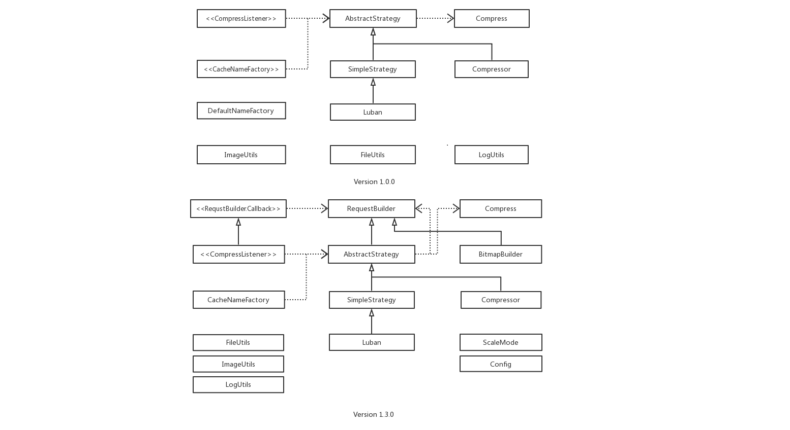
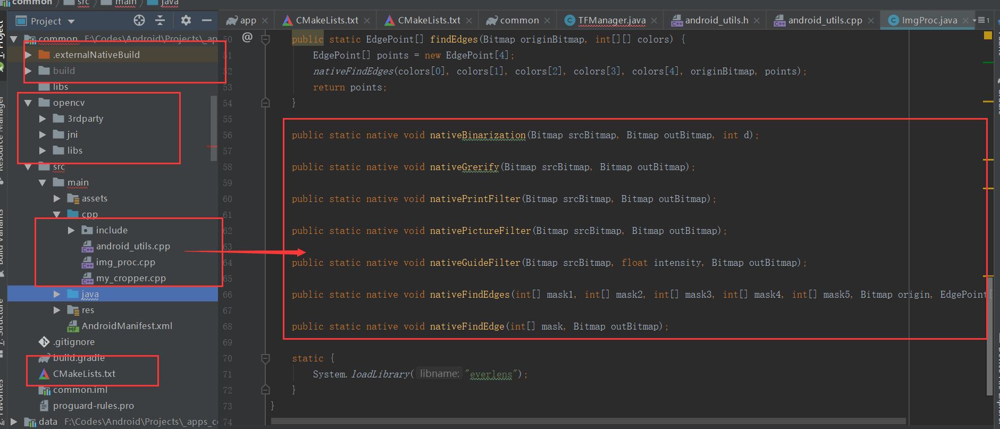

# Android 与计算机视觉

不管你是否从事计算机视觉相关的工作，了解这方面的内容总是好的，因为即使你现在的工作与 AI 无关，采用一些开放的 API 仍然有可能让你的应用做得更好。比如，百度开发平台就提供了许多 AI 相关的 API，像当下比较受欢迎的“白描”等应用，其实就是使用了百度的 API。所以，你也可以考虑一下能否借助一些语音和文字识别等功能来赋能自己的应用。

因为我们所做的计算机视觉的东西更多的是对图片进行处理，这就涉及到 OpenCV 和 Tensorflow 在 Android 端的应用，以及相机和 Android 端的其他图片处理逻辑。这不可避免地要用到 JNI 和 NDK 当中的一些内容。因此，在本篇文章中，我们想要讨论的内容主要包括以下几个方面的：

1. **Android 端图片压缩库封装**
2. **Android 端相机库封装和性能优化**
3. **JNI 和 NDK 调用，以及 CMake 在 Android 中的应用**
4. **OpenCV 在 Android 中的集成和应用**
5. **Tensorflow 在 Android 端的集成和应用**

其实之前的文章中我们也提到过一些今天我们想讨论的内容。所以在这里相关的技术底层的知识能带过的就直接带过。我们会给出相关的技术文章的链接，如果感兴趣的可以到指定的文章下面查看更具体的知识。

## 1、Android 端图片压缩库封装

为什么要做图像压缩呢？因为太大的图片上传速度比较慢，会影响程序的用户体验；而过分的压缩图片会导致程序识别出来的效率比较低。识别的效率每提高 1 个百分点，标注团队可能就要多标注几万张图片。经过测试发现，把图片的短边控制在 1100 左右是最合适的，那么此时我们就需要制定一个自己的压缩策略。

这个在之前的文章中我们已经讨论过，并且对 Android 端 Bitmap 相关的压缩的知识都做了介绍。您可以到下面的文章下面了解下我们是如何对图片压缩库进行封装的，以及 Android 中图片压缩的底层原理：

[开源一个 Android 图片压缩框架](https://juejin.im/post/5c87d01f6fb9a049b7813784)

当然，上面的文章在介绍的这方面的东西的时候，基于的是我们库的第一个版本，那个版本可以满足基本的功能。在后来的版本中，我们又对自己的库做了完善，增加了更多的 feature。这里我们主要介绍下新的框架相关的 API 以及后来我们如何做了兼容性的设计，以在第一个版本的基础之上进行了功能性的拓展。

在实际的使用过程中，我们发现更多的时候你需要对 Bitmap 进行处理而不是 File. 在这个时候，第一个版本的库就应用不上了。想了想，我们希望能够对自己的库进行拓展以支持更多的应用场景。这包括：

1. **在当前线程中直接获取压缩的 Bitmap 而不是通过 Callback 或者 RxJava 的形式传递结果**：因为我们有一部分代码本身就是在 RxJava 中异步执行的，回调或者使用 RxJava 会影响我们程序的逻辑结构。
2. **直接使用 Bitmap 或者 `byte[]` 作为参数进行压缩而不是先写入到 File 中，然后对文件进行读取和压缩**：这个是存在具体的应用场景，比如当你从相机当中获取数据的时候，实际获取到的是 `byte[]`，在连续拍摄的情况下，不断写入到文件再读取并进行压缩非常影响程序性能。
3. **支持直接返回 Bitmap 而不是只能返回 File 类型**：有时候我们需要对程序的局部做优化，比如图片处理结果的预览，此时，如果我们返回的是 File 的话，一样会影响我们程序的性能和逻辑结构。

最初，我们希望能够像 Glide 那样支持对自定义的数据结构进行压缩，然后自定义图片获取的逻辑，然而考虑到时间和兼容的问题，直接放弃了这个想法，转而采用更加简单、直接的方式：

1. **对入参这一块，直接使用重载函数接受不同的参数类型**；
2. **压缩的过程可以直接使用 `get()` 方法把压缩的中间结果返回给调用者**；
3. **增加 `asBitmap()` 方法，转换输出参数类型为 Bitmap 而不是 File 类型**。

因此，在后来的版本中，你可以像下面这样直接获取到 Bitmap 的结果：

```java
    Bitmap result = Compress.with(this, bytes)
            .setQuality(80)
            .strategy(Strategies.compressor())
            .setScaleMode(ScaleMode.SCALE_SMALLER) // 指定放缩的边
            .setMaxHeight(1100f)
            .setMaxWidth(1100f)
            .asBitmap()  // 调用这个方法表示期望的返回类型是 Bitmap 而不是 File
            .asFlowable()
            .subscribe(b -> {
                // do somthing
            })
```

这里关于 `asBitmap()` 方法的设计可以简单说明一下。



> 图片链接：[https://www.processon.com/view/link/5cdfb769e4b00528648784b7](https://www.processon.com/view/link/5cdfb769e4b00528648784b7])

在第一个版本中，我们采用的上图中第一个图的设计。在这里两种压缩策略均继承自 AbstractStrategy，其实上述的 `strategy()` 方法，你可以把它理解成**拐了一个弯**，也就是它返回的具体的策略，你下面能调用的方法都局限在具体的策略中。

在后来的设计中要在 `asBitmap()` 方法处返回一个具体的构建者继续按照返回 Bitmap 的逻辑进行处理。此时我们直接返回的是第二张图中的 BitmapBuilder 对象，而 Abstrategy 则依然按照返回 File 类型的逻辑走。这样我们可以轻易地在原来的基础上，通过**拐一个弯**的形式把后续的构建逻辑转移到了 BitmapBuilder 对象上面。同时，为了达到代码复用的目的，我们引入了泛型的 `RequestBuilder<T>`。这样 AbstractStrategy 和 BitmapBuilder 只需要实现它，并指定各自的资源类型即可。又因为按照之前的逻辑，我们一直在构建的都是 AbstractStrategy 对象，因此，我们只需要把 AbstractStrategy 作为参数传入到具体的 RequestBuilder 里面就可以从它上面直接获取 Bitmap 了。（Bitmap 是在之间串联的“通用货币”。）这样我们既复用了大量的代码又在兼容原始版本的基础上进行了功能的拓展，妙极！

## 2、Android 相机库封装和性能优化

对于一个 ToC 的应用来说，用户体验直观重要。按照我们的业务场景，如果使用拍照识别的效率比人工操作的效率还要低的话，那么人工智能似乎就没有存在的必要了。毕竟我们的目标是提升别人的工作效率，所以在相机这块就必须做到快速响应。

在项目的初期我们使用的是 Google 开源的 [CameraView](https://github.com/google/cameraview). 然而在实际的应用过程中，我们逐渐发现这个库存在大量不好的设计，影响了我们程序的应用性能：


> 配图是我们使用 TraceView 对程序执行过程进行的性能分析

1. **没必要的数据结构构建，影响相机启动速率**：首先，当从相机的属性当中读取相机支持的尺寸的时候它会使用这些参数构建一个尺寸的宽高比到尺寸列表的哈希表结构。然后具体的运算的时候从这个哈希表中读取尺寸再进行计算。这样设计很不好！因为当需要计算尺寸的时候遍历一遍尺寸列表可能并不会占用太多的时间，并且构建的哈希表结构使用并不频繁，而在相机启动阶段进行不必要的计算反而影响了相机的启动速率。

2. **打开相机的操作在主线程当中执行，影响界面响应速率**：前提是界面能够快速响应用户，即使打开的是一个黑色的等待界面也比按下没有响应更容易接受。通过 TraceView 我们发现相机 `open()` 的过程大概占用了相机启动速率的 25%。因此把这个方法的调用放在主线程中是不太合适的。

3. **相机不支持视频拍摄和预览**：这个库是不支持相机的视频拍摄和预览的。毕竟作为计算机视觉的一部分的实时处理也是很重要的一部分。就算当前的项目中没有这方面的功能，我们也应该考虑对这方面的功能进行支持。（这方面的内容基本就是 OpenGL + Camera）

于是乎，我们自己开发的一款相机库就诞生了。当然当初开发的一个原因也是希望能够支持 OpenGL。只是时间太有限，暂时还没有太多时间去关注这些问题:


> 图片链接：[https://www.processon.com/view/link/5c976af8e4b0d1a5b10a4049](https://www.processon.com/view/link/5c976af8e4b0d1a5b10a4049)

关于这个库，我只是把它所有的逻辑实现了一遍，并且在我的手机上面调试没有什么问题。如果具体应用到生存环境当中还需要更多的测试和验证。关于 Android 相机开发的知识，主要覆盖 Camera1 和 Camera2 两块内容。一个方法的实现逻辑看懂了，其他方法的实现与之类似，具体的内容可以参考项目的源码。因为本人当前时间和精力有限，所以暂时无法详细讲解相机 API 的使用。

我们可以简单概括一下这份设计图当中的一些内容：

1. **三种主要设计模式**：

    1. **门面模式**：考虑到兼容 Camera1 和 Camera2 的问题，我们需要对外提供统一的 API 调用，所以，我们考虑了使用门面模式来做一个统一的封装。这里定义了 Camera1Manager 和 Camera2Manager 两个实现，分别对应于两种不同的相机 API. 它们统一继承自 CameraManager 这个门面接口。这种设计模式的好处是对外是统一的，这样结合具体的工厂+策略模式，我们可以让用户在 Camera1 和 Camera2 之间自由选择。

    2. **策略模式+工厂模式**：因为考虑到各种不同应用场景的兼容，我们希望能够用户提供最大的自由度。所以，我们采用了策略的方式，对外提供了接口给用户来计算最终想要得到的相机尺寸等参数。所以这里我们定义了一个名为 `ConfigurationProvider` 的类，它是一个单例的类，除了负责获取相机参数的计算策略，同时肩负着内存缓存的责任。这样对于很多参数的计算，包括预览尺寸、照片尺寸、视频尺寸等可以让用户自由来指定具体的大小。

2. **三个主要的优化点**：

    1. **内存缓存优化**：实际上作为相机属性的相机所支持尺寸等信息是不变的，使用内存缓存缓存这些数据之后下次就无需再次获取并进行处理，这样可以在下次相机启动的时候显著提升程序响应的速率。

    2. **延迟初始化，不使用不计算**：为了提升程序的响应速率，我们甚至对数字的计算也进行了优化，当然这个优化点可能效果没有那么明显，但是如果你愿意精益求精的话，这也可以当作一个优化点。目前程序里面还是使用了浮点数进行计算，在早期对于作为哈希表映射的键的字段，我们甚至直接使用移位预算。当然这种优化的效果还要取决于整体的数据量，并且数据量越大的时候优化效果越明显。

    3. **异步线程优化**：在早期的版本中，我们使用的是私有锁进行线程优化。因为要把线程的 `open()` 和设置参数放在两个线程当中进行，因此不可避免地要遇到线程安全问题。而所谓的私有锁其实就类似于 `Collections.syncXXX()` 所返回的同步容器。其实就是对容器的每个方法进行加锁。这样虽然可以解决问题，但是程序的结构不好看。所以，后来的版本中，我们直接使用 HandlerThread 来进行异步的调用。所谓的 HandlerThread，顾名思义，就是 Handler 和 Thread 的结合。

（更多的内容可以参考：[Android 相机库开发实践](https://juejin.im/post/5cbf2667f265da037875980a)）

## 3、JNI 和 NDK 调用，以及 CMake 在 Android 中的应用 

在之前我们想在在 Java 或者 Android 中调用 C++ 代码是比较复杂的。这需要进行动态或者静态的注册。对于静态注册的方式，你需要一步一步地进行编译；对于动态注册的方式，你需要把方法一个个地在 native 层进行注册。不过后来有了 CMake 之后一切都变得简单了。当然对于 CMake，如果做过 native 的同学肯定不会陌生。对于一般应用层开发的同学，其实也可以了解下它。因为，有了它之后你可以很容易地把你的一部分实现逻辑放在 native 层里，而 native 层相对于 Java 层比较安全，而且借助 C++ 和 NDK 你可以做出更多有趣的东西。

要在 Android 端使用 CMake 而是很简单的，你需要首先在 AS 里面安装下相关的 SDK 工具:


然后，你需要在 Gradle 里面做简单的配置：


当然，虽然我们这样将其来容易，但是进行配置的时候可能需要很多的相关的专业知识。

这里面会配置到一个 CMake path，它就是指向的 CMake 的配置文件 `CMakeLists.txt`。通常我们程序中要用到的一些三方的 native 库就需要在这个地方进行配置。比如下面的就是之前项目里面的 CMake 的配置。这里面配置了一些 OpenCV 的库以及我们自己的代码所在的位置，并且引用了 NDK 里面的一些相关的库：

```cmake
# 设置要求的 CMake 的最低版本
cmake_minimum_required(VERSION 3.4.1)

# 指定头文件的目录
include_directories(opencv/jni/include
        src/main/cpp/include
        ../../common)

add_library(opencv_calib3d STATIC IMPORTED)
add_library(opencv_core STATIC IMPORTED)
# ....

#if(EXISTS ${PROJECT_SOURCE_DIR}/opencv/libs/${ANDROID_ABI}/libtbb.a)
#    add_library(tbb STATIC IMPORTED)
#endif()

set_target_properties(opencv_calib3d PROPERTIES IMPORTED_LOCATION ${PROJECT_SOURCE_DIR}/opencv/libs/${ANDROID_ABI}/libopencv_calib3d.a)
set_target_properties(opencv_core PROPERTIES IMPORTED_LOCATION ${PROJECT_SOURCE_DIR}/opencv/libs/${ANDROID_ABI}/libopencv_core.a)
set_target_properties(opencv_features2d PROPERTIES IMPORTED_LOCATION ${PROJECT_SOURCE_DIR}/opencv/libs/${ANDROID_ABI}/libopencv_features2d.a)
# ....

add_library(everlens
        SHARED
        src/main/cpp/img_proc.cpp
        src/main/cpp/img_cropper.cpp
        src/main/cpp/android_utils.cpp
        ../../common/EdgeFinder.cpp
        ../../common/ImageFilter.cpp)

find_library(log-lib
        log)

find_library(jnigraphics-lib
        jnigraphics)

if(EXISTS ${PROJECT_SOURCE_DIR}/opencv/libs/${ANDROID_ABI}/libtbb.a)
    target_link_libraries(
            my_library
            opencv_stitching
            opencv_features2d
            # ....

            ${log-lib}
            ${jnigraphics-lib})
else()
    target_link_libraries(
            my_library
            opencv_stitching
            opencv_features2d
            # ....

            ${log-lib}
            ${jnigraphics-lib})
endif()
```

对于 CMake 的一些指令，之前也进行过一些总结，并且对指定了官方文档的地址。如果想要了解的话，可以到文章下面了解更多的内容：

[常用的 CMake 指令总结](https://blog.csdn.net/github_35186068/article/details/88639757)

使用 CMake 的好处主要是 AS 支持得比较好：

1. 可以根据 native 层代码到 Java 层代码之间的关系，鼠标左键 + Ctrl 即可直接完成 native 层方法和 Java 层方法之间的跳转；

2. 无需进行繁琐的动态注册和静态注册，只需要在 CMake 和 Gradle 当中进行配置，可以把注意力更多地放在自己的代码的逻辑实现上。

当然，就算使用了 CMake 有时候还是需要了解一些 JNI 中动态注册的内容，因为有时候当你在 native 层中从 Java 层传入的对象上面获取信息的时候还是需要进行动态注册。比如，

```C++
#include <jni.h>
#include <string>
#include <android_utils.h>

// 定义一个结构体及实例 gPointInfo
static struct {
    jclass jClassPoint;
    jmethodID jMethodInit;
    jfieldID jFieldIDX;
    jfieldID jFieldIDY;
} gPointInfo;

// 初始化 Class 信息，注意下映射关系是如何表达的，其实就类似于反编译之后的注释
static void initClassInfo(JNIEnv *env) {
    gPointInfo.jClassPoint = reinterpret_cast<jclass>(env -> NewGlobalRef(env -> FindClass("android/graphics/Point")));
    gPointInfo.jMethodInit = env -> GetMethodID(gPointInfo.jClassPoint, "<init>", "(II)V");
    gPointInfo.jFieldIDX = env -> GetFieldID(gPointInfo.jClassPoint, "x", "I");
    gPointInfo.jFieldIDY = env -> GetFieldID(gPointInfo.jClassPoint, "y", "I");
}

// 动态注册，在这里初始化
extern "C"
JNIEXPORT jint JNICALL
JNI_OnLoad(JavaVM* vm, void* reserved) {
    JNIEnv *env = NULL;
    if (vm->GetEnv((void **) &env, JNI_VERSION_1_4) != JNI_OK) {
        return JNI_FALSE;
    }
    initClassInfo(env);
    return JNI_VERSION_1_4;
}
```

（更多的内容可以参考：[在 Android 中使用 JNI 的总结](https://juejin.im/post/5c79f5d0518825347a56275f)）

## 4、OpenCV 在 Android 中的集成和应用：图片裁剪以及透视变换

### 4.1 关于 OpenCV 的集成

当然，不引用 OpenCV 的 C++ 库，直接使用别人封装好的 Java 库也是可以的，这取决于具体的应用场景。比如，如果你不需要实现特别复杂的功能，只需要简单的图像处理即可，那么别人包装过的 Java 库已经可以完全满足你的需求。但如果你像我们一样，本身需要包装和编译来自算法同学的 C++ 算法，甚至还需要使用 OpenCV 的拓展库，那么使用 Java 包装后的库可能无法满足你的需求。

下面是 OpenCV 及其拓展库的 Github 地址：

- [OpenCV](https://github.com/opencv/opencv)
- [OpenCV-contrib](https://github.com/opencv/opencv_contrib)

有了这些库你还是无法直接将其应用到程序当中的。因为上述项目得到的是 OpenCV 的源码，主要是源代码以及一些头文件，还需要对它们进行编译然后再应用到自己的项目当中。

[Build OpenCV 3.3 Android SDK on Mac OSX](https://chaoyang.nz/post/build-opencv-android-sdk/)

当然也有一些已经编译完成的 OpenCV 及其拓展库，我们可以在 CMake 中配置之后直接将其引用到我们的项目中：

[opencv3-android-sdk-with-contrib](https://github.com/chaoyangnz/opencv3-android-sdk-with-contrib)

所以最终项目的结构如下：



左边圈出的部分是 OpenCV 及 CMake 的一些配置，右边是封装之后的 Java 方法。

### 4.2 关于 OpenCV 的应用

OpenCV 可以用来处理做很多图片处理的工作，很多工作是使用 Android 原生的 Bitmap 无法完成的。比如，图片不规则裁剪之后的透视变换、灰度化处理等。其实，不论你在 native 层如何对图片进行处理，在 Android 当中，对 native 层的输入和 native 层的输出都是 Bitmap. 而 `OpenCV::Mat` 就像是 native 层图片处理的通用货币。所以，一个完整的图片处理的流程大致是：

1. Step1: Java 层的 Bitmap 转换成 native 层的 Mat;
2. Step2: 使用 Mat 进行图片处理；
3. Step3: 将 native 层的 Mat 转换成 Java 层的 Bitmap 并返回。

将 Java 层的 Bitmap 转换成 native 层的 Mat 你可以使用下面的方法：

```C++
#include <jni.h>
#include <android/bitmap.h>
#include "android_utils.h"

void bitmap_to_mat(JNIEnv *env, jobject &srcBitmap, Mat &srcMat) {
    void *srcPixels = 0;
    AndroidBitmapInfo srcBitmapInfo;
    try {
        // 调用 AndroidBitmap 中的方法获取 bitmap 信息
        AndroidBitmap_getInfo(env, srcBitmap, &srcBitmapInfo);
        AndroidBitmap_lockPixels(env, srcBitmap, &srcPixels);
        uint32_t srcHeight = srcBitmapInfo.height;
        uint32_t srcWidth = srcBitmapInfo.width;
        srcMat.create(srcHeight, srcWidth, CV_8UC4);
        // 根据 bitmap 的格式构建不同通道的 Mat
        if (srcBitmapInfo.format == ANDROID_BITMAP_FORMAT_RGBA_8888) {
            Mat tmp(srcHeight, srcWidth, CV_8UC4, srcPixels);
            tmp.copyTo(srcMat);
            cvtColor(tmp, srcMat, COLOR_RGBA2RGB);
        } else {
            Mat tmp = Mat(srcHeight, srcWidth, CV_8UC2, srcPixels);
            cvtColor(tmp, srcMat, COLOR_BGR5652RGBA);
        }
        AndroidBitmap_unlockPixels(env, srcBitmap);
        return;
    } catch (cv::Exception &e) {
        AndroidBitmap_unlockPixels(env, srcBitmap);
        // 构建一个 Java 层的异常并将其抛出
        jclass je = env->FindClass("java/lang/Exception");
        env -> ThrowNew(je, e.what());
        return;
    } catch (...) {
        AndroidBitmap_unlockPixels(env, srcBitmap);
        jclass je = env->FindClass("java/lang/Exception");
        env -> ThrowNew(je, "unknown");
        return;
    }
}
```

这里主要是先从 Bitmap 中获取图片具体的信息，这里调用了 NDK 里面的图像相关的一些方法。然后利用得到的图片尺寸信息和颜色信息构建 OpenCV 里面的 Mat. Mat 就类似于 MATLAB 里面的矩阵，它包含了图像的像素等信息，并且也提供了类似于 `eye()`, `zeros()` 等类似的方法用来构建特殊的矩阵。

将 Bitmap 转换成 Mat 之后就是如何使用它们了。下面是一份用来对图片进行裁剪和透视变换的算法：

```C++
// 将 Java 层的顶点转换成 native 层的 Point 对象
static std::vector<Point> pointsToNative(JNIEnv *env, jobjectArray points_) {
    int arrayLength = env->GetArrayLength(points_);
    std::vector<Point> result;
    for(int i = 0; i < arrayLength; i++) {
        jobject point_ = env -> GetObjectArrayElement(points_, i);
        int pX = env -> GetIntField(point_, gPointInfo.jFieldIDX);
        int pY = env -> GetIntField(point_, gPointInfo.jFieldIDY);
        result.push_back(Point(pX, pY));
    }
    return result;
}

// 裁剪并且透视变化
extern "C" JNIEXPORT void JNICALL
Java_xxxx_MyCropper_nativeCrop(JNIEnv *env, jclass type, jobject srcBitmap, jobjectArray points_, jobject outBitmap) {
    std::vector<Point> points = pointsToNative(env, points_);
    if (points.size() != 4) {
        return;
    }
    // 取出四个顶点
    Point leftTop = points[0], rightTop = points[1], rightBottom = points[2], leftBottom = points[3];

    // 获取源图和结果图对应的 Mat
    Mat srcBitmapMat, dstBitmapMat;
    bitmap_to_mat(env, srcBitmap, srcBitmapMat);
    AndroidBitmapInfo outBitmapInfo;
    AndroidBitmap_getInfo(env, outBitmap, &outBitmapInfo);
    int newHeight = outBitmapInfo.height, newWidth = outBitmapInfo.width;
    dstBitmapMat = Mat::zeros(newHeight, newWidth, srcBitmapMat.type());

    // 将图片的顶点放进集合当中，用来调用透视的方法
    std::vector<Point2f> srcTriangle, dstTriangle;

    srcTriangle.push_back(Point2f(leftTop.x, leftTop.y));
    srcTriangle.push_back(Point2f(rightTop.x, rightTop.y));
    srcTriangle.push_back(Point2f(leftBottom.x, leftBottom.y));
    srcTriangle.push_back(Point2f(rightBottom.x, rightBottom.y));

    dstTriangle.push_back(Point2f(0, 0));
    dstTriangle.push_back(Point2f(newWidth, 0));
    dstTriangle.push_back(Point2f(0, newHeight));
    dstTriangle.push_back(Point2f(newWidth, newHeight));

    // 获取一个映射的转换矩阵
    Mat transform = getPerspectiveTransform(srcTriangle, dstTriangle);
    warpPerspective(srcBitmapMat, dstBitmapMat, transform, dstBitmapMat.size());

    // 将 Mat 转换成 Bitmap 输出到 Java 层
    mat_to_bitmap(env, dstBitmapMat, outBitmap);
}
```

算法最终的输出结果：

<div align="middle"></div>

## 5、Tensorflow 在 Android 端的集成和应用：图片边缘检测

在之前对图片的边缘进行检测的时候，因为发现 OpenCV 算法效果不太理性，所以后来选择使用 TensorFlow 对图片进行边缘检测。这就涉及到在 Android 端集成 Tensorflow Lite。前段时间也看到爱奇艺的 SmartVR 的介绍。借助一些官方的资料，在 Android 端使用 TF 并不难。在 Tensorflow 的开源仓库中已经有一些 Sample 可供参考：

- [Tensorflow github repository](https://github.com/tensorflow/tensorflow)
- [Tensorflow lite offical](https://www.tensorflow.org/lite)

做边缘检测当然有些大材小用的味道，但是对于我们 Android 开发者来说，借这个机会了解如何在 Android 端集成一些 Tensorflow 也可以拓展一下。毕竟这种东西属于当下比较热门的东西，说不定哪天心血来潮自己训练一个模型呢 :)

在 Android 端引入 Tensorflow 并不复杂，只需要添加相关的仓库以及依赖：

```groovy
allprojects {
    repositories {
        jcenter()
        maven { url 'https://google.bintray.com/tensorflow' }
    }
}

dependencies {
    // ...
    // tensorflow
    api 'org.tensorflow:tensorflow-lite:0.0.0-nightly'
}
```

困难的地方在于如何对训练的模型的输入和输出进行处理。因为所谓的模型，你可以将其理解成锻炼出来的一个函数，你只需要按照要求的输入，它就可以按照固定的格式给你返回一个输出。所以，具体的输入和输出是什么样的还要取决于锻炼模型的同学。

在我们之前开发的时候，最初是训练模型的同学使用 Python 代码调用的模型。使用 Python 虽然代码简洁，但是对于客户端开发简直就是噩梦。因为像 [NumPy](https://numpy.org/) 和 [Pillow](https://pillow.readthedocs.io/en/stable/) 这种函数库，一行代码的任务，你可能要“翻译”很久。后来，我们使用的是 `C++ + OpenCV` 的形式。对于 iOS 开发，因为他们可以使用 Object-C 与 C++ 混编，所以比较轻松。对于 Android 开发则需要做一些处理。

下面是加载模型以及在调用 Tensorflow 之前在 Java 层所做的一些处理：

```java
public class TFManager {

    private static TFManager instance;

    private static final float IMAGE_MEAN = 128.0f;
    private static final float IMAGE_STD = 128.0f;

    private Interpreter interpreter;
    private int[] intValues;
    private ByteBuffer imgData;
    private int inputSize = 256;

    public static TFManager create(Context context) { // DCL
        if (instance == null) {
            synchronized (TFManager.class) {
                if (instance == null) {
                    instance = new TFManager(context);
                }
            }
        }
        return instance;
    }

    // 从 Assets 中加载模型，用来初始化 TF
    private static MappedByteBuffer loadModelFile(AssetManager assets, String modelFilename) throws IOException {
        AssetFileDescriptor fileDescriptor = assets.openFd(modelFilename);
        FileInputStream inputStream = new FileInputStream(fileDescriptor.getFileDescriptor());
        FileChannel fileChannel = inputStream.getChannel();
        long startOffset = fileDescriptor.getStartOffset();
        long declaredLength = fileDescriptor.getDeclaredLength();
        return fileChannel.map(FileChannel.MapMode.READ_ONLY, startOffset, declaredLength);
    }

    // 初始化 TF
    private TFManager(Context context) {
        try {
            interpreter = new Interpreter(loadModelFile(context.getAssets(), "Model.tflite"));
            interpreter.setNumThreads(1);
            interpreter.resizeInput(0, new int[]{1, 256, 256, 3});
            intValues = new int[inputSize * inputSize];
            imgData = ByteBuffer.allocateDirect(inputSize * inputSize * 4 * 3);
            imgData.order(ByteOrder.nativeOrder());
        } catch (IOException e) {
            e.printStackTrace();
        }
    }

    // 边缘识别
    public EdgePoint[] recognize(Bitmap bitmap) {
        long timeStart = System.currentTimeMillis();
        imgData.rewind();
        Bitmap scaledBitmap = Bitmap.createScaledBitmap(bitmap, inputSize, inputSize, true);
        scaledBitmap.getPixels(intValues, 0, scaledBitmap.getWidth(), 0, 0, scaledBitmap.getWidth(), scaledBitmap.getHeight());
        for (int i = 0; i < inputSize; ++i) {
            for (int j = 0; j < inputSize; ++j) {
                int pixelValue = intValues[i * inputSize + j];
                // 取 RBG 做归一化处理，结果在 -1 到 1 之间
                imgData.putFloat((((pixelValue >> 16) & 0xFF) - IMAGE_MEAN) / IMAGE_STD); // R
                imgData.putFloat((((pixelValue >> 8) & 0xFF) - IMAGE_MEAN) / IMAGE_STD); // G
                imgData.putFloat(((pixelValue & 0xFF) - IMAGE_MEAN) / IMAGE_STD); // B
            }
        }
        LogUtils.d("----------TFManager prepare imgData cost : " + (System.currentTimeMillis() - timeStart));

        timeStart = System.currentTimeMillis();
        Map<Integer, Object> outputMap = new HashMap<>();
        outputMap.put(0, new float[1][256][256][5]);

        Object[] inputArray = {imgData};
        // 调用 TF 进行识别
        interpreter.runForMultipleInputsOutputs(inputArray, outputMap);

        // 对识别的结果进行处理，主要是对图片的像素进行处理
        float[][][][] arr = (float[][][][]) outputMap.get(0);
        int[][] colors = new int[5][256 * 256];
        for (int i=0; i<5; i++) {
            for (int j=0; j<256; j++) {
                for (int k=0; k<256; k++) {
                    colors[i][j*256 + k] = (int) (arr[0][j][k][i] * 256);
                }
            }
        }
        LogUtils.d("----------TFManager handle TF result cost : " + (System.currentTimeMillis() - timeStart));

        timeStart = System.currentTimeMillis();
        // 将得到的图片像素按照固定的格式交给 native 层继续进行边缘识别
        EdgePoint[] points = ImgProc.findEdges(bitmap, colors);
        LogUtils.d("----------TFManager" + Arrays.toString(points));
        LogUtils.d("----------TFManager find edges cost : " + (System.currentTimeMillis() - timeStart));
        return points;
    }
}
```

这里程序的主要执行流程是：

1. 从 Assets 的模型文件中获取打开输入流，然后从输入流中打开一个管道，这里用到了 NIO 中的一些类。然后，从管道中获取一个字节缓存区。文件读写的时候管道直接与缓冲区进行交互。除了作为一个缓存区，这个缓存区还具有内存映射的功能。类似于 mmap 吧，主要是为了提升文件读写的效率。

2. 初始化并配置 Tensorflow，上面的一些参数用来设置线程数量等信息，比较简单。后面等一些参数主要用来按照模型等要求对 TF 进行调整。比如，我们使用模型来判断图片的顶点的时候使用的是只包含 RGB 三个纬度的 256 * 256 的图片。所以，这里使用了下面几行代码来进行设置：

```java
// inputSize = 256;
interpreter.resizeInput(0, new int[]{1, 256, 256, 3});
intValues = new int[inputSize * inputSize];
// 256 * 256 的图片，3 个纬度，四张图
imgData = ByteBuffer.allocateDirect(inputSize * inputSize * 4 * 3);
```

3. 对要识别对图片进行处理。这里需要先对图片进行放缩，将其控制到 256 * 256 的大小。然后，使用 Bitmap 的方法获取图片的像素。下面的几行代码是对图片对 RBG 三种色彩提取，并分别对其进行归一化处理。处理之后对结果统一写入到 imgData 当中，作为模型对输入。

4. 按照模型对输出对文件的格式构建一个 Java 对象作为模型的输出参数。调用模型的方法进行识别。

5. 对模型对输出结果进行处理。根据我们上述定义对模型输出 `new float[1][256][256][5]`，这里实际对含义是 256 * 256 的 5 张图片。因为模型输出的数据并不是原始的像素信息，所以需要乘以 256 来得到真正的图片的像素。最后就是使用这些像素以及 Bitmap 的方法来得到最终的 Bitmap.

上面调用完了模型但是整个流程还没有结束。因为只是调用模型得到了五张识别之后的图片。这五张图片就是只留下了图片边缘的边框，所以想要得到图片的顶点还需要继续对这五张图进行处理。这部分需要一些算法，虽然在 Java 层去判断也是可以的，但是在 native 层，借助 OpenCV 的一些库可以使整个过程更加简单。因此，这里又要涉及一个 JNI 调用：

```C++
extern "C"
JNIEXPORT void JNICALL
Java_com_xxx_ImgProc_nativeFindEdges(JNIEnv *env, jclass type, jintArray mask1_, jintArray mask2_,
                                                        jintArray mask3_, jintArray mask4_, jintArray mask5_,
                                                        jobject origin, jobjectArray points) {
    // 从 Java 中传入的数组元素
    jint *mask1 = env->GetIntArrayElements(mask1_, NULL);
    jint *mask2 = env->GetIntArrayElements(mask2_, NULL);
    jint *mask3 = env->GetIntArrayElements(mask3_, NULL);
    jint *mask4 = env->GetIntArrayElements(mask4_, NULL);
    jint *mask5 = env->GetIntArrayElements(mask5_, NULL);

    // 原图转换成 Native 层的 mat
    Mat originMat;
    bitmap_to_mat(env, origin, originMat);

    // 构建一个集合
    std::vector<jint*> jints;
    jints.push_back(mask1);
    jints.push_back(mask2);
    jints.push_back(mask3);
    jints.push_back(mask4);
    jints.push_back(mask5);

    // 从像素点中得到对应的 Mat 并将其放到一个集合当中
    std::vector<cv::Mat> masks;
    for (int k = 0; k < 5; ++k) {
        Mat mask(256, 256, CV_8UC1);
        for (int i = 0; i < 256; ++i) {
            for (int j = 0; j < 256; ++j) {
                mask.at<uint8_t>(i, j) = (char)(*(jints[k] + i * 256 + j));
            }
        }
        masks.push_back(mask);
    }

    try {
        // 调用算法进行边缘检测
        EdgeFinder finder = ImageEngine::EdgeFinder(
                originMat, masks[0], masks[1], masks[2], masks[3], masks[4]);
        vector<cv::Point2d> retPoints = finder.FindBorderCrossPoint();
        // 将得到的“点”转换成 Java 层的对象
        jclass class_point = env->FindClass("com/xxx/EdgePoint");
        jmethodID method_point = env->GetMethodID(class_point, "<init>", "(FF)V");
        // 将顶点组成一个 Java 数组返回
        for (int i = 0; i < 4; ++i) {
            jobject point = env->NewObject(class_point, method_point, retPoints[i].x, retPoints[i].y);
            env->SetObjectArrayElement(points, i, point);
        }
    }  catch (cv::Exception &e) {
        jclass je = env->FindClass("java/lang/Exception");
        env -> ThrowNew(je, e.what());
        return;
    } catch (...) {
        jclass je = env->FindClass("java/lang/Exception");
        env -> ThrowNew(je, "unknown");
        return;
    }

    // 释放资源
    env->ReleaseIntArrayElements(mask1_, mask1, 0);
    env->ReleaseIntArrayElements(mask2_, mask2, 0);
    env->ReleaseIntArrayElements(mask3_, mask3, 0);
    env->ReleaseIntArrayElements(mask4_, mask4, 0);
    env->ReleaseIntArrayElements(mask5_, mask5, 0);
}
```

这里的主要逻辑是把之前得到的像素以及原始图片的 Bitmap 统一传入到 native 层，然后这些像素中得到 OpenCV 对应的 Mat，再一起作为算法的参数调用算法来得到顶点信息。最后把得到的顶点信息映射成 Java 层的类，并将其放在数组中返回即可。

从上面的流程中也可以看出，整个调用流程实际上进行了多次的 JNI 调用：

1. 调用 Bitmap 的方法本身就是一次 JNI 调用，调用了 Android 底层的 Skia 的库来实现图片处理；
2. TF-Lite 本身就是对 native 层方法的一个封装，调用其方法也涉及到 JNI 调用；
3. 最后是对模型识别的结果进行处理，这也涉及 JNI 调用。

JNI 调用的时候需要进行额外的转换操作，需要在函数开始的时候把 Java 层的对象转换成 native 层的对象，在算法调用完毕之后再将 native 层的对象转换成 Java 层的对象。这是我们以后可以优化的一个地方。

## 总结

以上就是计算机视觉在 Android 中的应用，主要涉及 JNI 的一些内容，以及 OpenCV 和 Tensorflow 的一些应用。再这之前介绍了图片压缩和相机库的一些封装，如果你的程序中需要一些图片处理的功能的话，我想这些东西肯定是对你有用的 :D

-------

关注作者获取更多知识：

- 掘金：[https://juejin.im/user/585555e11b69e6006c907a2a](https://juejin.im/user/585555e11b69e6006c907a2a)
- Github：[https://github.com/Shouheng88](https://github.com/Shouheng88)
- CSDN：[https://blog.csdn.net/github_35186068](https://blog.csdn.net/github_35186068)
- 微博：[https://weibo.com/u/5401152113](https://weibo.com/u/5401152113)
- 博客：[https://shouheng88.github.io/](https://shouheng88.github.io/)

更多知识请参考 [Github, Android-notes](https://github.com/Shouheng88/Android-notes)。
